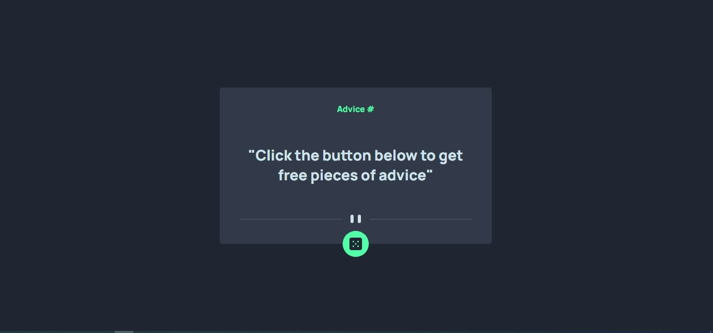
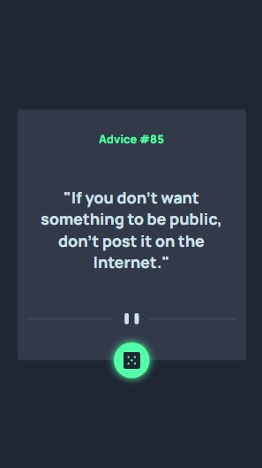

# Frontend Mentor - Advice generator app solution

This is a solution to the [Advice generator app challenge on Frontend Mentor](https://www.frontendmentor.io/challenges/advice-generator-app-QdUG-13db). Frontend Mentor challenges help you improve your coding skills by building realistic projects.

## Overview

### The challenge

Users should be able to:

- generate a random advice

### Screenshot

### Links

- Live Site URL: [https://pezemiwe.github.io/advice-generator-app-main/](https://pezemiwe.github.io/advice-generator-app-main/)

### Built with

- Semantic HTML5 markup
- CSS custom properties
- Flexbox
- CSS Grid
- JavaScript

## Author

- [Paul Ezemiwe](https://github.com/pezemiwe)

